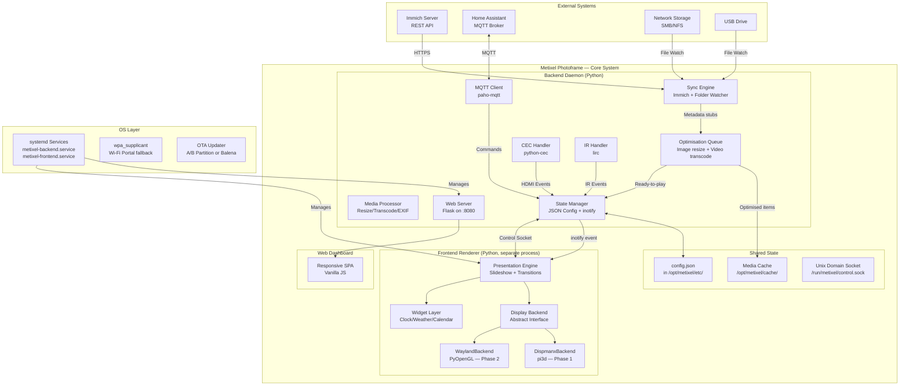

# Metixel Photoframe — Architecture & Implementation Plan

> **Version:** 1.1.0
> **Status:** Implementation Phase 1
> **Target Hardware Phase 1:** Raspberry Pi 2, 3, Zero 2 W (512MB–1GB RAM, VideoCore IV)
> **Target Hardware Phase 2:** Raspberry Pi 4, 5, Radxa Zero 3W (1GB–8GB RAM, VideoCore VI/VII, Mali G52)

---

## Table of Contents

1. [Tech Stack Recommendation](#1-tech-stack-recommendation)
2. [System Architecture Diagram](#2-system-architecture-diagram)
3. [File & Directory Structure](#3-file--directory-structure)
4. [State Management & Hot Reload Strategy](#4-state-management--hot-reload-strategy)
5. [Phase-by-Phase Implementation Roadmap](#5-phase-by-phase-implementation-roadmap)
6. [Detailed Subsystem Design](#6-detailed-subsystem-design)

---

## 1. Tech Stack Recommendation

### 1.1 The Graphics Pipeline

All Pi models use the same `Pi3dBackend`. The underlying driver is determined by the OS:

| Concern | Trixie + KMS (Pi 2/3/Zero 2 W) | Pi 4/5 + KMS |
|---|---|---|
| **GPU** | VideoCore IV | VideoCore VI / VII |
| **Kernel Driver** | Mainline Mesa + vc4 KMS/DRM | Mainline Mesa + v3d/vc4 KMS/DRM |
| **Display API** | KMS/DRM via Wayland compositor (cage) | KMS/DRM via Wayland compositor (cage) |
| **X11 Surface** | XWayland shim — pi3d gets an X11 window | XWayland shim — pi3d gets an X11 window |
| **RAM Overhead** | ~120MB (app + cage + XWayland) | ~120MB (app + cage + XWayland) |
| **OpenGL** | GLES 2.0 via Mesa | GLES 2.0/3.0 via Mesa |

**Critical constraint**: Raspberry Pi OS **Bullseye** (Debian 11) was the last release supporting ARMv6 (Pi 1, original Pi Zero). Metixel now targets **Trixie** (Debian 13) as the baseline — Pi Zero 2 W and Pi 2+ are the minimum.

### 1.2 Application-Layer Abstraction

The application does NOT import pi3d directly. It imports from a display backend interface:

```
metixel/
├── display/
│   ├── __init__.py          # Factory: auto-detect hardware, return correct backend
│   ├── backend.py           # Abstract base class: DisplayBackend
│   ├── dispmanx_backend.py  # Phase 1: wraps pi3d, uses Mesa EGL via cage/XWayland
│   └── wayland_backend.py   # Phase 2: PyOpenGL + EGL on Wayland/DRM (future)
│   └── dev_backend.py       # Desktop dev: pygame-based software renderer
```

### 1.3 Per-Model OS & Graphics Strategy

| Model | CPU | RAM | OS | Graphics Path | Display Surface |
|---|---|---|---|---|---|
| **Pi Zero 2 W / Pi 2 / Pi 3** | ARMv7/v8 | 512MB–1GB | Trixie Lite | Mesa → KMS/DRM → cage/XWayland → pi3d | Wayland + XWayland shim |
| **Pi 4 / Pi 5** | ARMv8 | 1–8GB | Trixie Lite | Mesa → KMS/DRM → cage/XWayland → pi3d | Wayland + XWayland shim |
| **Radxa Zero 3W** | ARMv8 | 1–4GB | Debian/Ubuntu | Mesa → KMS/DRM → cage/XWayland → pi3d or PyOpenGL | Wayland + XWayland shim |

**Key insight:** On Trixie, pi3d needs an X11 surface — but you don't need the full `xorg` server. Just `xwayland` (~10MB) plus a minimal Wayland compositor like `cage`. The compositor owns the display via DRM/KMS, XWayland provides the X11 compatibility layer pi3d needs, and pi3d renders via Mesa EGL.

**Launch commands:**

```bash
# All Trixie-based platforms (Pi Zero 2 W / Pi 2 / Pi 3 / Pi 4 / Pi 5):
cage -- python3 -m metixel --mode frontend --config etc/config.json
# cage starts a Wayland session + XWayland — pi3d gets its X11 surface
```

The application code and `Pi3dBackend` are identical across all platforms. Only the launch wrapper changes.
| **GPU Memory** | `dtoverlay=vc4-kms-v3d` + `gpu_mem=16` | `dtoverlay=vc4-kms-v3d` + `gpu_mem=16` |
| **Kernel** | 6.6 LTS (Trixie default) | 6.6 LTS (Trixie default) |
| **Init System** | systemd (stripped) | systemd or Busybox init (Buildroot) |

### 1.4 Core Dependencies (Python 3.9+)

| Package | Purpose | Phase 1 | Phase 2 |
|---|---|---|---|
| `pi3d` | OpenGL ES rendering (via Mesa EGL on Trixie) | ✅ | ❌ |
| `Pillow` | Image loading, EXIF parsing, resizing | ✅ | ✅ |
| `numpy` | Array operations for image processing | ✅ | ✅ |
| `Flask` | Lightweight HTTP server for web dashboard | ✅ | ✅ |
| `watchdog` | File system monitoring for media folders | ✅ | ✅ |
| `paho-mqtt` | MQTT client for Home Assistant | ✅ | ✅ |
| `requests` | HTTP client for Immich API sync | ✅ | ✅ |
| `python-cec` | HDMI-CEC control | ✅ | ✅ |
| `lirc` | IR remote control | ✅ | ✅ |

---

## 2. System Architecture Diagram



### 2.1 Process Architecture

The system runs as **two systemd services**:

1. **`metixel-backend.service`** — The long-running backend daemon:
   - Sync engine (Immich polling, folder watching)
   - Media processor (background thread pool)
   - Web server (Flask on `0.0.0.0:8080`)
   - MQTT client
   - CEC/IR input handlers
   - Writes `config.json` on settings change

2. **`metixel-frontend.service`** — The display renderer:
   - Starts AFTER `metixel-backend.service`
   - Opens the display backend
   - Reads `config.json` at startup, watches for `inotify IN_MODIFY` events
   - Runs the main render loop
   - Connects to `/run/metixel/control.sock` for immediate commands

**Why two processes?** The frontend renderer must own the GPU context (EGL context is bound to one process). The backend handles I/O-heavy operations that could cause frame drops if run in the same thread.

---

## 3. File & Directory Structure

```
metixel-photoframe/                           # Repository root
├── metixel/                           # Python package
│   ├── __init__.py
│   ├── __main__.py                    # Entry point
│   │
│   ├── backend/                       # Backend daemon
│   │   ├── __init__.py
│   │   ├── daemon.py                  # Main daemon orchestrator
│   │   ├── sync/
│   │   │   ├── __init__.py
│   │   │   ├── immich.py             # Immich API client
│   │   │   ├── folder_watcher.py     # inotify-based folder sync
│   │   │   └── scheduler.py          # Cron-like sync scheduling
│   │   ├── processing/
│   │   │   ├── __init__.py
│   │   │   ├── image.py              # EXIF parse, resize, downsample, rotate
│   │   │   ├── video.py              # ffmpeg transcode, thumbnail, first/last frame extraction
│   │   │   ├── optimisation_queue.py # 4-phase pipeline orchestrator
│   │   │   └── matte.py              # Virtual matte board generation
│   │   ├── web/
│   │   │   ├── __init__.py
│   │   │   ├── server.py             # Flask application
│   │   │   ├── routes/
│   │   │   │   ├── __init__.py
│   │   │   │   ├── config.py         # GET/PUT config endpoints
│   │   │   │   ├── media.py          # Upload, list, delete media
│   │   │   │   ├── logs.py           # System log viewer
│   │   │   │   └── widgets.py        # Widget configuration CRUD
│   │   │   ├── static/
│   │   │   │   ├── css/
│   │   │   │   │   └── dashboard.css
│   │   │   │   └── js/
│   │   │   │       └── dashboard.js
│   │   │   └── templates/
│   │   │       └── index.html
│   │   ├── input_handlers/
│   │   │   ├── __init__.py
│   │   │   ├── cec.py                # HDMI-CEC via libcec
│   │   │   └── ir.py                 # LIRC-based IR remote
│   │   ├── mqtt_client.py            # Home Assistant MQTT integration
│   │   └── state.py                  # StateManager
│   │
│   ├── frontend/                      # Display renderer
│   │   ├── __init__.py
│   │   ├── renderer.py               # Main render loop, frame timing
│   │   ├── presentation/
│   │   │   ├── __init__.py
│   │   │   ├── engine.py             # Slideshow orchestrator
│   │   │   ├── transitions.py        # Fade, slide, zoom, Ken Burns math
│   │   │   ├── layout.py             # Fit-to-screen, virtual matte, smart crop
│   │   │   └── video_player.py       # Hardware-accel video playback
│   │   ├── widgets/
│   │   │   ├── __init__.py
│   │   │   ├── base.py               # Widget ABC
│   │   │   ├── clock.py              # Digital & analog clock widget
│   │   │   ├── weather.py            # Weather forecast widget
│   │   │   └── calendar.py           # Calendar events widget
│   │
│   ├── display/                       # Display backend abstraction
│   │   ├── __init__.py               # detect_backend() → returns correct Backend
│   │   ├── backend.py                # DisplayBackend ABC
│   │   ├── dispmanx_backend.py       # Phase 1: pi3d wrapper
│   │   ├── wayland_backend.py        # Phase 2: PyOpenGL on DRM/Wayland (future)
│   │   └── dev_backend.py            # Desktop dev: pygame-based
│   │
│   └── shared/                        # Shared types and utilities
│       ├── __init__.py
│       ├── config.py                  # Config schema, validation, defaults
│       ├── models.py                  # Data classes: MediaItem, Album, Widget, etc.
│       └── ipc.py                     # Unix socket protocol (JSON messages)
│
├── etc/                               # Configuration files
│   ├── config.json                    # Main runtime configuration
│   └── logging.conf                   # Python logging configuration
│
├── scripts/                           # Build & deployment scripts
│   ├── build_phase1.sh               # Build Trixie Lite image for Pi 2/3/Zero 2 W
│   ├── build_phase2.sh               # Build Trixie/Buildroot image for Pi 4/5 + non-Pi SBCs
│   ├── quiet_boot.sh                 # Splash screen + silent boot config
│   ├── setup_ap.sh                   # Wi-Fi captive portal setup
│   ├── setup_trixie.sh              # Install deps for Trixie Lite (cage + pi3d)
│   └── run_trixie.sh                # Launch via cage (Wayland + XWayland) on Trixie
│
├── systemd/                           # systemd unit files
│   ├── metixel-backend.service       # Backend daemon (all platforms)
│   ├── metixel-cage.service          # Frontend under cage (Trixie/KMS)
│   └── metixel-frontend.service      # Frontend direct (legacy Bullseye)
│
├── docker/                            # Balena / container support
│   ├── Dockerfile.phase1
│   └── Dockerfile.phase2
│
├── tests/                             # Automated tests
│   ├── test_backend/
│   ├── test_frontend/
│   └── test_display/
│
├── docs/                              # Additional documentation
│   ├── API.md
│   ├── HARDWARE.md
│   └── WIDGET_DEV.md
│
├── ARCHITECTURE.md                    # This file
├── CLAUDE.md                          # AI assistant instructions
├── README.md                          # Project overview
├── LICENSE                            # AGPL v3
├── requirements-phase1.txt            # Python deps for Phase 1
├── requirements-phase2.txt            # Python deps for Phase 2
└── pyproject.toml                     # Modern Python project metadata
```

---

## 4. State Management & Hot Reload Strategy

### 4.1 Configuration Flow

```
Web UI (browser)
    │  PUT /api/config
    ▼
Backend Daemon (Flask)
    │  1. Validate against config schema
    │  2. Write atomically to config.json (write temp → os.replace)
    │  3. Touch /run/metixel/config.updated flag file
    ▼
config.json on disk  ──inotify IN_MODIFY──▶  Frontend Renderer
                                              │
                                              │  Reload config struct
                                              │  Apply changes without restart
                                              ▼
                                         Render loop continues
```

### 4.2 Real-Time Control

For commands needing immediate action:

```
IR Remote / CEC / MQTT / Web UI
    │
    ▼
Backend Daemon receives command
    │
    ▼
Unix Domain Socket (/run/metixel/control.sock)
    │  JSON message: {"cmd": "next", "album_id": "abc123"}
    ▼
Frontend Renderer (non-blocking socket check in render loop)
    │  Process command immediately
    ▼
Next frame reflects change
```

### 4.3 Frame Integrity During Config Changes

- Config read into **immutable snapshot** at start of each slideshow cycle
- Inotify events are **coalesced** — only last change applied per cycle
- GPU texture cache uses **LRU eviction** — never during active crossfade
- Render loop at fixed tick rate (30 FPS), yielding CPU to backend process

---

## 5. Phase-by-Phase Implementation Roadmap

### Phase 0: Project Scaffolding & Development Environment (CURRENT)

**Duration:** 1–2 weeks  
**Goal:** Bootable dev environment, CI pipeline, placeholder files.

1. ✅ Initialize monorepo with directory structure
2. ✅ Create `pyproject.toml` with dependencies
3. Create `dev_backend.py` (pygame-based) for local testing without Pi hardware
4. Write the `DisplayBackend` ABC with all methods documented
5. Set up GitHub Actions for linting (ruff), type checking (mypy), and unit tests

### Phase 1: Core on Raspberry Pi 2/3/Zero 2 W (Trixie)

**Duration:** 6–8 weeks  
**Goal:** Working digital photo frame on Pi Zero 2 W (512MB) and Pi 3 (1GB).

#### Step 1.1: OS Image & Quiet Boot
- Trixie Lite base image
- `config.txt`: `dtoverlay=vc4-kms-v3d`, `gpu_mem=16`, `disable_splash=1`
- `cmdline.txt`: `console=tty3 quiet loglevel=3 logo.nologo`
- Plymouth splash screen with metixel logo (optional)
- Debug mode: GPIO pin 17 HIGH or `/boot/debug` file → verbose boot

#### Step 1.2: Display Backend (pi3d via cage/XWayland)
- `dispmanx_backend.py` wrapping pi3d — pi3d auto-detects Mesa EGL on Trixie
- Memory: `Texture(free_after_load=True)`, `GL_RGB565` format, max 3 GPU textures
- Verify 30 FPS on Pi Zero 2 W with 512MB
- Launch via `cage --` for Wayland + XWayland surface

#### Step 1.3: Presentation Engine
- Slideshow queue with configurable display duration
- Transition effects using pi3d blend shaders
- Ken Burns effect via texture coordinate animation
- Virtual matte board and fit-to-screen layout
- Video playback via ffmpeg → numpy → `Texture.update_ndarray()`

#### Step 1.4: Backend Daemon
- StateManager with atomic JSON writes
- Immich API client (auth, albums, assets, download)
- Folder watcher (inotify + polling fallback)
- MediaProcessor (resize, EXIF, transcode, cache)

#### Step 1.5: Web Dashboard
- Flask backend with responsive SPA
- Pages: Dashboard, Settings, Media, Widgets, Logs

#### Step 1.6: Input & Control
- CEC handler via python-cec
- IR handler via LIRC
- MQTT client for Home Assistant
- Wi-Fi captive portal fallback

#### Step 1.7: Power Management
- Screen off timer: `vcgencmd display_power 0`
- Configurable on/off schedule

### Phase 2: Modern Hardware (RPi 4/5, Radxa Zero 3W)

**Duration:** 4–6 weeks  
**Goal:** Adapt Phase 1 codebase to Wayland/KMS.

#### Step 2.1: Wayland Display Backend
- Implement `wayland_backend.py` using PyOpenGL + EGL/GBM/DRM
- Reuse all presentation engine and widget code unchanged

#### Step 2.2: Buildroot Image
- Buildroot external tree for metixel-photoframe
- Python 3, Mesa, Wayland (cage), ffmpeg, Pillow, numpy
- Target sub-300MB rootfs, <5 second boot

#### Step 2.3: Balena Integration
- Containerized metixel with fleet management

#### Step 2.4: OTA Updates (Non-Balena)
- A/B root partition scheme with signed updates

### Phase 3: Polish & Ecosystem

**Duration:** Ongoing
- Calendar widget (CalDAV)
- Weather widget (OpenWeatherMap)
- Multi-language localization
- Community widget marketplace

---

## 6. Detailed Subsystem Design

### 6.1 Media Processing Pipeline (4-Phase)

```
┌─────────────────────────────────────────────────────────────┐
│ Phase 1: WATCH (FolderWatcher)                              │
│                                                             │
│  Scan enabled watch paths → gather minimal metadata only:   │
│  • File type (image/video by extension)                     │
│  • Pixel dimensions (PIL header for images, ffprobe for     │
│    videos)                                                  │
│  • Video codec name (for threshold gating)                  │
│                                                             │
│  Does NOT resize, transcode, or add to playlist.            │
│  Pushes metadata stubs to the OptimisationQueue.            │
└──────────────────────┬──────────────────────────────────────┘
                       │ list of MediaItem stubs
                       ▼
┌─────────────────────────────────────────────────────────────┐
│ Phase 2: OPTIMISE (OptimisationQueue — background thread)   │
│                                                             │
│  ALL videos go through VideoProcessor.process() — frame     │
│  extraction (first + last frame) is always required for     │
│  slideshow preload/swap.  The transcode step is skipped     │
│  for H.264 videos within resolution limits.                 │
│                                                             │
│  Classifies each item against thresholds:                   │
│  ┌─────────────────────┐  ┌─────────────────────┐           │
│  │ Image threshold     │  │ Video threshold     │           │
│  │ Default: display    │  │ Default: display    │           │
│  │ resolution.         │  │ resolution + must   │           │
│  │ Skip if ≤ threshold │  │ be H.264 codec.     │           │
│  │ (UI overridable).   │  │ Skip transcode if   │           │
│  │                     │  │ both met (frames    │           │
│  │                     │  │ still extracted).   │           │
│  └────────┬────────────┘  └────────┬────────────┘           │
│           │                        │                        │
│  Priority: Images first → Videos second.                    │
│  Current job finishes before switching.                     │
│  Cleanup partial transcodes on startup.                     │
│  Frame extraction is idempotent (skips if cached).          │
└──────────────────────┬──────────────────────────────────────┘
                       │ Optimised MediaItems
                       ▼
┌─────────────────────────────────────────────────────────────┐
│ Phase 3: QUEUE (StateManager playlist → PresentationEngine) │
│                                                             │
│  Slideshow playlist contains ONLY ready-to-play items:      │
│  • Images ≤ threshold (no opt needed)                       │
│  • Optimised images (post-resize)                           │
│  • Videos with cached first/last frames                     │
│    (VideoProcessor extracts .1.frame / .2.frame)            │
│  • Transcode-skipped videos (H.264 + within limits)         │
│  • Optimised videos (post-transcode)                        │
│                                                             │
│  Playlist persisted to /run/metixel/playlist.json.          │
│  Frontend reads via polling + inotify.                      │
└──────────────────────┬──────────────────────────────────────┘
                       │
                       ▼
┌─────────────────────────────────────────────────────────────┐
│ Phase 4: SYNC (Immich Syncer → feeds into Phase 1)         │
│                                                             │
│  Downloads to media/sync/immich/ (default).                 │
│  This directory is a watch path — picked up by Phase 1     │
│  on the next poll cycle.                                    │
│  Schedule-based or manually triggered.                      │
└─────────────────────────────────────────────────────────────┘
```

**RAM budget for Phase 1 (512MB Pi Zero W):**
- Linux + systemd: ~80MB
- Backend daemon (Python): ~60MB
- Frontend renderer (Python + pi3d): ~80MB
- GPU memory (gpu_mem=128): 128MB (separate pool)
- Media processing (peak, one file): ~100MB
- **Total**: ~320MB of 512MB — tight but workable
- **Mitigation**: Process one file at a time; subprocess for heavy work; `gc.collect()` after large images

### 6.2 Immich API Sync Protocol

```
1. POST /api/auth/login → { "apiKey": "..." }
2. GET /api/albums → [ { "id", "albumName", "assetCount", "updatedAt" } ]
3. For each album:
   GET /api/albums/{id} → { "assets": [ { "id", "originalPath", ... } ] }
4. For each NEW or UPDATED asset:
   GET /api/assets/{id}/original → raw file download
5. MediaProcessor.ingest()
```

- Poll interval: configurable (default 5 min Immich, 30 sec local)
- Sync state persisted in cache/sync_state.json

### 6.3 Virtual Matte Board Algorithm

```python
def create_matte(image_w, image_h, screen_w, screen_h, matte_color):
    image_ratio = image_w / image_h
    screen_ratio = screen_w / screen_h
    if abs(image_ratio - screen_ratio) < 0.02:
        return (fit="fill", matte=None)
    if image_ratio > screen_ratio:
        # Image wider → letterbox top/bottom
        display_h = screen_w / image_ratio
        matte_top = (screen_h - display_h) / 2
        return (fit="contain", matte_rects=[...], color=matte_color)
    else:
        # Image taller → pillarbox left/right
        display_w = screen_h * image_ratio
        matte_left = (screen_w - display_w) / 2
        return (fit="contain", matte_rects=[...], color=matte_color)
```

### 6.4 Widget System Interface

```python
class Widget(ABC):
    position: tuple[int, int]
    size: tuple[int, int]
    refresh_interval: int       # seconds
    z_index: int                # draw order (0=behind, 10=on top)

    def update(self, config: dict, shared_state: dict) -> None: ...
    def draw(self, backend: DisplayBackend) -> None: ...
    def needs_refresh(self) -> bool: ...
```

Widgets render on a transparent overlay layer via a second orthographic camera at higher z_index. Photos render behind widgets without being affected.

### 6.5 Quiet Boot Configuration

**`/boot/config.txt`:**
```
disable_splash=1
avoid_warnings=2
gpu_mem=128
```

**`/boot/cmdline.txt`:**
```
console=tty3 quiet loglevel=3 logo.nologo plymouth.enable=0 vt.global_cursor_default=0 fsck.mode=auto
```

**systemd drop-ins:**
```ini
# /etc/systemd/system/getty@tty1.service.d/noclear.conf
[Service]
TTYVTDisallocate=no
```

Debug mode: `/boot/debug` file OR GPIO 17 pulled HIGH → verbose boot.

### 6.6 OTA Update Mechanism

A/B partition layout:
```
/dev/mmcblk0p1  /boot   (FAT32, shared)
/dev/mmcblk0p2  /       (ext4, partition A — active)
/dev/mmcblk0p3  /       (ext4, partition B — standby)
/dev/mmcblk0p4  /data   (ext4, persistent user data)
```

Update flow:
1. Download signed update tarball
2. Verify signature against embedded public key
3. Extract to standby partition
4. Update `/boot/autoboot.txt`
5. Set bootloader `tryboot` flag → reboot
6. Boot success → mark good; 3 failures → fallback

---

## Appendix A: Key Technical Constraints

| Constraint | Pi Zero W (Phase 1 worst case) | Mitigation |
|---|---|---|
| RAM | 512MB (shared via split) | `gpu_mem=128`; one file at a time; subprocess for heavy work |
| CPU | Single-core ARM11 @ 1GHz | HW video decode; no real-time video effects |
| GPU | VideoCore IV @ 400MHz | Max 3 GPU textures; GL_RGB565; 30 FPS cap |
| Storage | SD card (8–32GB) | Aggressive caching; LRU eviction; warn if <500MB |
| Network | 2.4GHz Wi-Fi 4 | Background downloads; process locally at low priority |

## Appendix B: Comparison with Existing Projects

| Feature | Metixel Photoframe | pi3d PictureFrame | dakboard | MagicMirror² |
|---|---|---|---|---|
| No X11/Wayland (Phase 1) | ✅ | ✅ | ❌ | ❌ |
| Immich integration | ✅ native | ❌ | ❌ | ❌ (3rd party) |
| Home Assistant MQTT | ✅ native | ❌ | ❌ | ✅ |
| Pi Zero W support | ✅ target | ✅ | ❌ | ❌ |
| Video playback | ✅ HW accel | ❌ | ❌ | ✅ |
| Hot reload config | ✅ | ❌ | ❌ | ❌ |
| OLED protection | ✅ | ❌ | ❌ | ❌ |
| OTA updates | ✅ | ❌ | ❌ | ❌ |
