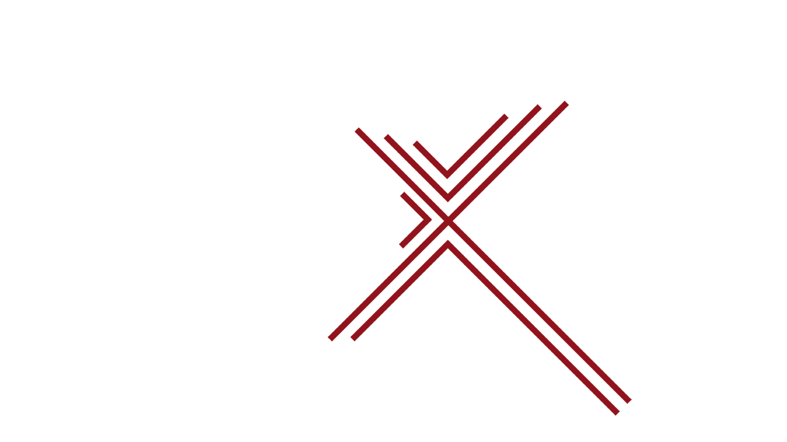
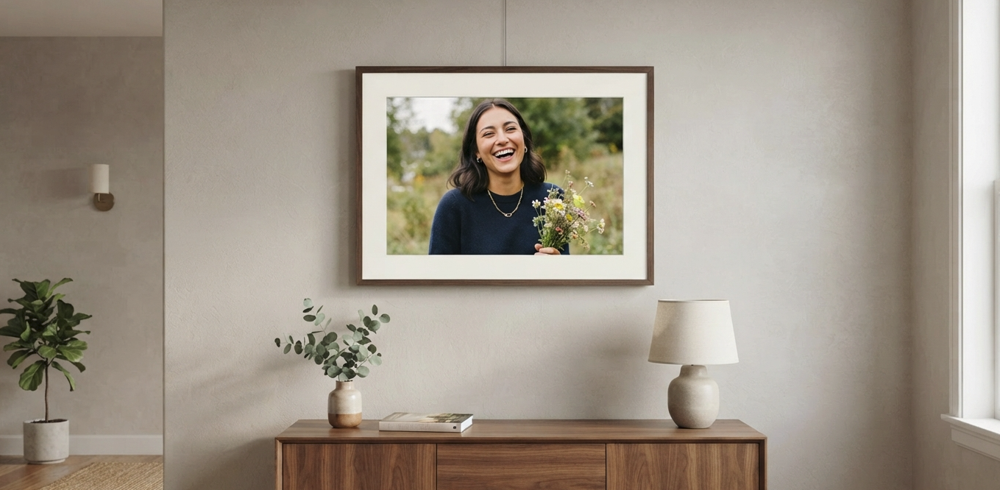
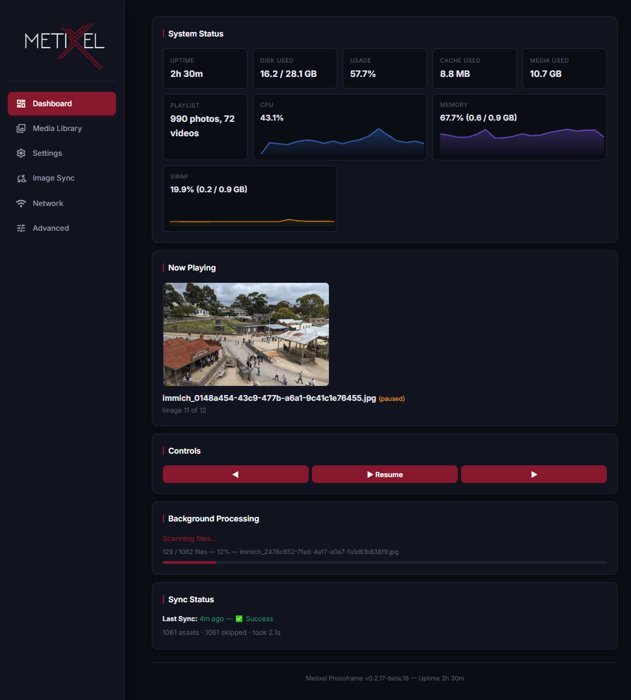

<p align="center">
  <a href="https://github.com/dennisadvani/metixel-photoframe">
    
  </a>
</p>

<p align="center">
  <em>A custom, open-source digital photo frame OS for Raspberry Pi.<br>Beautiful slideshows. Immich integration. Web UI. Zero-cloud. Just pictures and videos.</em>
</p>

<p align="center">
  
</p>

<p align="center">
  
</p>

---

## What is Metixel Photoframe?

Metixel Photoframe turns a Raspberry Pi into a polished, hardware-accelerated digital photo frame. It's a complete operating system overlay — not just an app — designed to run headless on a wall or shelf, pulling photos from local folders, USB drives, network shares, or an [Immich](https://immich.app/) server.

- 🖥️ **Web dashboard** on port 80/http — configure everything from any browser
- 🎞️ **Smooth crossfade transitions** with hardware OpenGL ES rendering
- 📷 **Native Immich v3 sync** — auto-pull albums and assets
- 🎬 **Video playback** via VLC
- 🔒 **Runs locally** — no cloud dependency, your photos stay on your network

---

## Features

| Category | Feature | Status |
|---|---|---|
| **Display** | Hardware-accelerated OpenGL ES 2.0 rendering (pi3d + Mesa) | ✅ |
| | Smooth crossfade, slide, and fade transitions | ✅ |
| | Automatic resolution detection | ✅ |
| **Media** | Local folder watching (auto-detect new files) | ✅ |
| | Immich server sync (albums, favorites, people) | ✅ |
| | Video playback | ✅ |
| **Control** | Web dashboard (vanilla JS SPA) | ✅ |
| **System** | systemd services (auto-start on boot) | ✅ |
| | Atomic config writes (no corruption on power loss) | ✅ |

---

## Hardware Support

| Models | RAM | SWAP | Capabilities | GPU |
|---|---|---|---|---|
| Pi Zero 2 W | 512MB | Required | Images only (no video playback, optimisation or transcoding) | VideoCore IV | ✅ Active |
| Pi 2, Pi 3 | 1GB | Required | Images + video playback (1080p max; >1080p requires transcoding before being queued) | VideoCore IV | ✅ Active |
| **Pi 5** | 2GB+ | Recommended | Images + video playback + transcoding — **recommended platform** | VideoCore VII | ✅ Active |

> **Notes:**
> - A SWAP file is **required** on all models.
> - Pi 3 hardware video decoder is limited to **1080p** — higher-resolution video must be transcoded down.
> - Video playback or transcoding needs at least **1GB RAM** — the Pi Zero 2 W (512MB) is image-only.
> - **Pi 5 (2GB+)** is the recommended platform — it runs the same Trixie image as Pi 2/3 with no changes.

**Tested on:** Raspberry Pi 3 (1GB) and Raspberry Pi 5 (2GB) running Debian Trixie (13) Lite.

See [`docs/HARDWARE.md`](docs/HARDWARE.md) for detailed setup and accessory recommendations.

---

## Quick Start

```
1. Download the pre-built image from GitHub Releases
2. Flash it with Raspberry Pi Imager
3. Boot your Pi → done.
```

📥 **[Download latest release →](https://github.com/dennisadvani/metixel-photoframe/releases/latest)**

Full step-by-step guide: **[Getting Started →](docs/GETTING_STARTED.md)**

---

## Installation

Two ways to install — both work on Raspberry Pi 3, 4, and 5.

| | 🚀 Pre-built image | 🔧 Manual install |
|---|---|---|
| **Time** | ~10 minutes | ~1 hour |
| **Method** | Download .img.zip → flash with Pi Imager → boot | Flash Trixie Lite → run setup script → reboot |
| **Guide** | [Getting Started](docs/GETTING_STARTED.md) | [Installation Guide](docs/INSTALLATION.md) |

After installation, connect to Wi-Fi using one of several methods — see
**[WiFi Setup Guide →](docs/WIFI_SETUP.md)**

### Manual Service Control

```bash
sudo systemctl restart metixel-backend   # Restart the web dashboard
sudo systemctl restart metixel-cage      # Restart the display renderer
sudo systemctl stop metixel-backend metixel-cage   # Stop everything
sudo journalctl -u metixel-backend -f    # Follow logs
```

---

## Media Sources

| Source | How it works |
|---|---|
| **Local folder** | Via watch paths in the Web UI — new files auto-imported |
| **Network share** | Mount via SMB/NFS, add to watch paths |
| **Immich** | Configure server URL + API key — albums auto-sync every N seconds |

---

## Documentation

| Document | Content |
|---|---|
| **[docs/GETTING_STARTED.md](docs/GETTING_STARTED.md)** | Quick-start guide — 10 minutes to first slideshow |
| **[docs/INSTALLATION.md](docs/INSTALLATION.md)** | Both install methods in detail (image + manual) |
| **[docs/WIFI_SETUP.md](docs/WIFI_SETUP.md)** | All Wi-Fi connection methods (captive portal, Ethernet, SSH, etc.) |
| **[docs/HARDWARE.md](docs/HARDWARE.md)** | Hardware setup, wiring, and accessories |
| [`FEATURES.md`](FEATURES.md) | Complete feature list |
| [`ARCHITECTURE.md`](ARCHITECTURE.md) | Full system design & implementation roadmap |
| [`docs/API.md`](docs/API.md) | REST API and IPC protocol reference |
| [`THIRD_PARTY_LICENSES.md`](THIRD_PARTY_LICENSES.md) | Dependency license details |

---

## Contributing

Contributions are welcome! Before diving in:

1. Read [`ARCHITECTURE.md`](ARCHITECTURE.md) — it's the single source of truth
2. Check the [issues](https://github.com/dennisadvani/metixel-photoframe/issues) for open tasks
3. Set up a dev environment — see **[Development Setup →](docs/INSTALLATION.md#path-c-development-setup-remote-via-samba)**


---

## License

[Apache 2.0](LICENSE) © 2024–2026 Metixel Photoframe Contributors

See [`NOTICE`](NOTICE) for attributions and [`THIRD_PARTY_LICENSES.md`](THIRD_PARTY_LICENSES.md) for third-party dependency licenses.
