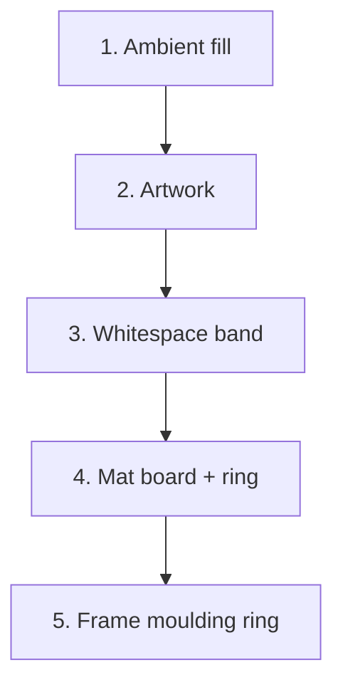

# Geometry Model

Canonical specification for the framing engine. This document is the authority:
`metixel.framing_engine` implements it and `metixel.framing_templates` supplies
style presets for it. If code and this document disagree, the document wins.

## Why the model is shaped this way

The engine decides where the frame, mat, mat window, whitespace and artwork sit
on a digital display. The physical stack is a *frame* containing a *mat*, cut to
the frame opening rather than measured from the screen, and all geometry is
computed in **millimetres**.

The model deliberately avoids several approaches that do not survive contact
with real framing:

| Avoided | Why |
| --- | --- |
| Modelling a mat as margins from the display edge | Wrong parent rect; only works when the panel and opening coincide. Replaced by `Frame` + `Mat Window`. |
| Physical and virtual mats coexisting | A mat is either a real board or software-drawn, never both. |
| Double mat / mat layers | Deferred — see [Deferred](#deferred) |
| Style fractions of the frame opening | Replaced by a linear mm border. |
| Growing the ring to absorb aspect mismatch | The ring no longer expands with the artwork. |
| `bottomWeight`-style optical offsets | Replaced by `mat_window_offset`. |

## Vocabulary

Names are mandated: always qualify **Frame Opening** and **Mat Window**. Never
use a bare "opening" or "window".

| Term | Meaning |
| --- | --- |
| **Screen** | The lit LCD. 1920 × 1200 px, 518 × 324 mm for Metixel. |
| **Frame Opening** | The inner edge of the frame moulding. |
| **Mat Window** | The hole cut in the mat — the aperture the screen is seen through. |
| **Mat Ring** | The band of mat between the Mat Window and the Frame Opening. |
| **Frame Outer** | The outside edge of the moulding. |
| **edge_margin** | Inset from the screen edge; the tolerance that keeps the bezel hidden. |
| **Whitespace** | An intentional band between the Mat Window edge and the artwork. |
| **Ambient fill** | The derived residue of a fixed Mat Window meeting mismatched artwork. |
| **Artwork** | The image or video being presented. |

## The core model

**The screen is the constant. Only the Mat Ring is given.**

```
Screen          518 × 324 mm                       FIXED
Mat Window      screen − 2 × edge_margin           FIXED by default
Mat Ring        GIVEN linear mm (the style)        ← the only style variable
Frame Opening   Mat Window + 2 × Mat Ring          grows
Frame Outer     Frame Opening + 2 × moulding       grows
```

A deeper mat needs a **bigger frame**. The screen and the Mat Window never
change.

The ring is expressed as a **linear measurement** — `"give it a 3-inch mat"` —
because that is how a framer thinks, not as a percentage of area.

Two properties make this work:

- **No circularity.** Every value derives forward from the screen; nothing
  depends on its own output.
- **A uniform ring is safe.** The Mat Window's shape is fixed independently of
  the ring, so a uniform border cannot distort it.

## Paint order and nesting

Painting order is **not** the same as nesting order.

### Paint order (bottom → top)



Ambient fill is the only full-rectangle layer. Whitespace, mat and moulding are
**annuli** (rectangle minus inner hole) and are disjoint from the artwork, which
is why painting the artwork before the rings is safe.

### Nesting (outermost → innermost)

```
Frame Outer ⊇ Frame Opening ⊇ Mat Window ⊇ Whitespace/Artwork presentation ⊇ Artwork
```

Every step is a containment; none may have a negative width on any axis.

## Units

**Sizes are measurements; positions and intensities are ratios.**

| Kind | Unit | Examples |
| --- | --- | --- |
| Sizes | **millimetres** | Frame Opening, Mat Window, Mat Ring, moulding, whitespace gap, blur radius |
| Positions | **ratio 0..1** | `mat_window_offset`, focal point, face rectangles |
| Intensities | **ratio 0..1** | `darken` |

Geometry is computed in mm throughout. Normalised views are produced only at the
boundary, against a **caller-chosen reference** (see [Output views](#output-views)).

```
x_norm = length_x / reference_width_mm
y_norm = length_y / reference_height_mm
```

A uniform mm band is **not** a uniform normalised band on a non-square panel.
Computing in mm avoids that class of bug entirely.

### Metixel screen

The panel has two sizes: the **active area** (the lit region, where pixels are)
and the **panel** itself, which includes the non-screen border. It can also be
mounted **landscape or portrait** — the assembly simply rotated 90°.

```
                     landscape          portrait
active area          518 x 324 mm       324 x 518 mm
pixels               1920 x 1200 px     1200 x 1920 px
panel                528 x 337 mm       337 x 528 mm
non-screen per side  5 mm / 6.5 mm      5 mm / 6.5 mm

scale               0.27 mm/px         (~94.1 DPI, square pixels)
area                167,832 mm²        (identical — it is the same panel)
```

Every length in the model is expressed against the **active area**: nothing is
ever drawn outside it. The panel size exists so the engine can tell whether the
frame covers the non-screen area — see [Panel coverage](#panel-coverage).

**The reference dimension is 320 mm in both mountings**, because it is the
*shorter side*. A style therefore produces the same ring width whichever way up
the screen is, which is what you want: the mat is the same mat.

Available as the presets `METIXEL_16_10_1920x1200` (landscape),
`METIXEL_16_10_PORTRAIT`, and `METIXEL_SCREENS` keyed by orientation.

### Panel coverage

The non-screen area must **never** be visible. The frame overlaps the panel by
the **rebate**:

```
required_rebate = max(0, (panel − Frame Opening) / 2)     per side
```

The clamp at zero matters: once the Frame Opening is at least as large as the
panel, no rebate is required — the ring has grown the opening past the edge.

| | Virtual | Physical, `gallery` (ring 40) |
| --- | --- | --- |
| Frame Opening | 514 × 320 | 594 × 400 |
| Required rebate per side | **7 mm / 8.5 mm** | **0 mm** |

**The rebate is part of the moulding, so it cannot be wider than the moulding.**
A rebate wider than the frame is physically impossible, and the engine rejects
it:

```
required_rebate ≤ moulding_width      per side, hard
```

So a frame can be smaller than the panel — it simply needs enough ring (or a
large enough Mat Window) for the opening to reach the panel edge, and a moulding
wide enough to house the resulting rebate. When neither is possible, the remedy
is one of: widen the moulding, enlarge the Mat Window, or increase the Mat Ring.

`FramingResult.frame.required_rebate` reports the value per side so the website
can tell a customer the minimum rebate their frame must provide.

## Inputs, in user-flow order

The order the website and the Metixel app collect inputs. Each step constrains
the next.

### Step 1 — Screen

Screen size and pixel dimensions. Everything absolute is expressed against this.

### Step 2 — Will you use a physical mat?

A single boolean, `has_physical_mat`.

There is no `mat.type` enum. "No mat" is a **virtual mat with `ring = 0`**, which
pins the Mat Window to the Frame Opening. The geometry is identical, so the two
are one concept with two presentations.

### Step 2a — Physical mat

| Input | Unit | Notes |
| --- | --- | --- |
| Framing style | preset | Supplies the Mat Ring width. |
| Mat Ring width | mm | Authoritative. Uniform shorthand, or per side. |
| `moulding_width` | mm | The frame width. |
| `mat_window_offset` | ratio | Reveal weight. |
| Overflow behaviour | enum | `crop` or `fill`. |
| Ambient appearance | preset | Only meaningful when overflow is `fill`. |

The Mat Window defaults to `screen − 2 × edge_margin` — here **514 × 320 mm** —
and may be overridden to any size or shape that is `⊆ screen` (see
[Mat Window override](#mat-window-override)).

```
Mat Window      = 514 × 320 mm        (fixed, or overridden)
Mat Ring        = 60 mm per side      (gallery)
Frame Opening   = 514 + 120 × 320 + 120 = 634 × 440 mm
Frame Outer     = 634 + 80 × 440 + 80   = 714 × 520 mm   (40 mm moulding)
```

The framing style is offered here as **both a suggestion and a selectable
preset**, because a customer may still be deciding which physical mat to buy and
wants to visualise how each style would look.

### Step 2b — Virtual mat

| Input | Unit | Notes |
| --- | --- | --- |
| Framing style | preset | Supplies the Mat Ring width. |
| `moulding_width` | mm | The frame width. |
| `edge_margin` | mm | Insets the Frame Opening to hide the bezel. |
| `mat_window_offset` | ratio | Reveal weight. |
| Whitespace | enabled + gap | Global option; applies in every scenario. |

```
Frame Opening   = 514 × 320 mm     (screen − 2 × edge_margin, ≤ screen)
Mat Window      = 514 − 120 × 320 − 120 = 394 × 200 mm   (gallery)
Frame Outer     = 514 + 80 × 320 + 80   = 594 × 400 mm
```

All framing styles apply, because the virtual mat is software and can shrink the
visible area without any physical constraint.

## The two branches

The Mat Ring always means *the band between the Mat Window and the Frame
Opening*. The branch decides which end is anchored.

| | **Physical mat** | **Virtual mat** |
| --- | --- | --- |
| Anchor | **Mat Window** = screen − 2 × margin | **Frame Opening** = screen − 2 × margin |
| Then | Frame Opening = Mat Window + 2 × ring | Mat Window = aspect-matched inside the opening |
| Ring | **uniform** (the board is cut once) | **uneven** — absorbs the aspect mismatch |
| Mode changes | the **frame gets bigger** | the **visible area gets smaller** |
| Screen used | **constant** (98 %) | **varies** with the mode |
| Ambient fill | yes, when the artwork ≠ Mat Window | **never** — the Mat Window is cut to match |
| Frame Opening | may **exceed** the screen | **≤ screen** (hard) |

`Frame Opening ⊆ Screen` is therefore **branch-dependent**: for a virtual mat it
is a hard constraint (a larger opening would expose the bezel), while for a
physical mat a larger opening is *required*, because the mat board spans the
panel and the ring has to live somewhere.

### Worked comparison — 518 × 324 screen, 2 mm margin, 40 mm moulding

**Physical mat** — the Mat Window is fixed, the frame grows, the ring is uniform.

| Style | Ring | Mat Window | Frame Opening | Frame Outer | Screen used |
| --- | --- | --- | --- | --- | --- |
| `borderless` | 0 | 514 × 320 | 514 × 320 | 594 × 400 | 98 % |
| `modern` | 14.4 | 514 × 320 | 542.8 × 348.8 | 622.8 × 428.8 | 98 % |
| `classic` | 25.6 | 514 × 320 | 565.2 × 371.2 | 645.2 × 451.2 | 98 % |
| `gallery` | 40.0 | 514 × 320 | 594.0 × 400.0 | 674.0 × 480.0 | 98 % |
| `museum` | 57.6 | 514 × 320 | 629.2 × 435.2 | 709.2 × 515.2 | 98 % |

**Virtual mat** — the Frame Opening is fixed; the Mat Window is cut to the
artwork, so the ring is uneven and screen use depends on the artwork's aspect.
Figures below are for 3:2 artwork.

| Style | Shortest ring | Frame Opening | Mat Window | Frame Outer | Screen used |
| --- | --- | --- | --- | --- | --- |
| `borderless` | 0 | 514 × 320 | 514 × 320 | 594 × 400 | 98 % |
| `modern` | 14.4 | 514 × 320 | 485.2 × 291.2 | 594 × 400 | 86 % |
| `classic` | 25.6 | 514 × 320 | 462.8 × 268.8 | 594 × 400 | 74 % |
| `gallery` | 40.0 | 514 × 320 | 434.0 × 240.0 | 594 × 400 | 62 % |
| `museum` | 57.6 | 514 × 320 | 398.8 × 204.8 | 594 × 400 | 49 % |

## Mat Ring

The Mat Ring is the band between the Mat Window and the Frame Opening. Styles
express it as a percentage of the **reference dimension** — neither an area
fraction nor a fraction of the opening, but the linear border a framer would
name.

```
reference rect      = screen − 2 × edge_margin            # 514 × 320 mm for Metixel
reference dimension = min(reference rect width, height)   # 320 mm
ring_target         = fraction × reference dimension      # the SHORTEST ring
```

The **reference dimension is the shorter side of the reference rect**. For
portrait media the height is shorter; for landscape media the width is. Taking
the shorter side keeps the percentage meaningful in both orientations:

| Reference rect | Reference dimension |
| --- | --- |
| 400 × 600 mm | **400 mm** |
| 600 × 400 mm | **400 mm** |
| 1000 × 1500 mm | **1000 mm** |
| 514 × 320 mm (Metixel) | **320 mm** |

So for the Metixel screen a `gallery` ring of 12.5 % is `0.125 × 320 = 40 mm`.

The reference rect is derived from the **screen**, once, before any ring is
applied. It is fixed and branch-independent, which keeps the computation
forward-only and non-circular.

### The ring absorbs the mismatch

A **uniform** ring cannot match an arbitrary artwork aspect. In the virtual
branch the ring therefore becomes **uneven**, absorbing the mismatch so that no
ambient fill is ever needed:

```
ring_target = fraction × reference dimension
inner       = Frame Opening inset by ring_target on ALL sides
Mat Window  = contain-fit(media_aspect, inner)     # aspect-matched to the artwork
ring per side = (Frame Opening − Mat Window) / 2   # shortest ring == ring_target
```

The Mat Window is cut to the artwork's aspect, so the **shortest ring is exactly
`ring_target`** and the opposite axis carries the excess.

For the Metixel Frame Opening (514 × 320) with `ring_target = 40 mm`, the inner
rect is 434 × 240:

| Artwork aspect | Mat Window | Ring x / y | Limiting axis |
| --- | --- | --- | --- |
| 21:9 | 434.0 × 186.0 | 40.0 / 67.0 | width |
| 16:9 | 426.7 × 240.0 | 43.7 / 40.0 | height |
| 3:2 | 360.0 × 240.0 | 77.0 / 40.0 | height |
| 1:1 | 240.0 × 240.0 | 137.0 / 40.0 | height |
| 9:16 | 135.0 × 240.0 | 189.5 / 40.0 | height |

The limiting axis flips on whether the artwork aspect exceeds the inner rect's
aspect (434/240 = 1.808) — note that 16:9 (1.778) is **height**-limited even
though the artwork is wider than it is tall.

> A uniform ring with the leftover as ambient fill was considered and rejected.
> It produces the *same artwork size* — the leftover is simply owned by the
> ambient layer instead of the mat — but it adds a second visual mechanism and
> makes the mat noticeably smaller for off-aspect media.

The **physical** branch is the mirror image: the board is cut once, so the ring
is **uniform** and the leftover becomes ambient fill instead. This is where the
square-Mat-Window case lives (see [Mat Window](#mat-window)).

### Matching the physical ring to the virtual mat

The two branches produce different proportions from the *same* style fraction
``f``, because they cut the ring on different references:

| | Virtual | Physical |
| --- | --- | --- |
| Reference | the **artwork** (inset by the ring) | the **whole active area** |
| Ring / artwork | `f / (1 − 2f)` | `f x reference / artwork` |

A physical mat is the entire active area, so a ring of the same width is a much
smaller share of the artwork — the mat reads *thin* where the virtual one reads
generous. Matching the **ring-to-artwork ratio**, which is the proportion the eye
reads, gives a plain multiplier:

```
multiplier  = 1 / (1 − 2f)
ring_physical = f x reference x multiplier
              = reference x f / (1 − 2f)
```

Worked for `museum` (``f = 0.25``, reference 320 mm) with landscape artwork:

| | Virtual | Physical |
| --- | --- | --- |
| Frame Opening | 514 × 320 | 834 × 640 |
| Artwork | 240 × 160 | 480 × 320 |
| Ring | 137 / 80 | 160 uniform |
| **Ring / artwork (short axis)** | **50 %** | **50 %** |
| **Ring / opening (short axis)** | **25 %** | **25 %** |

Both proportions agree, so the mat reads the same whichever branch is in use.
``f`` must be below 0.5, or the ring would consume the whole opening.

An **explicit** ring (a scalar or per-side millimetres) is taken at face value
and never scaled: the caller has chosen a measurement deliberately.

### Two consequences of design C

Cutting the Mat Window to the artwork's aspect has two effects worth knowing:

**1. Whitespace sits inside the Mat Window**, between the window edge and the
artwork — not between the artwork and the ring. The Mat Window is cut first,
whitespace is reserved inside it, and the artwork is placed in what remains:

```
whitespace on:  Mat Window 360 × 240  →  6 mm band  →  artwork 348 × 228
whitespace off: Mat Window 360 × 240  →  artwork 360 × 240
```

**2. Focal-point placement only has slack when the Mat Window is larger than
the artwork.** The window matches the artwork exactly, so at `ring > 0` there is
nothing to shift. Focal placement has an effect where slack exists: once
whitespace is applied, at `ring = 0`, and in the physical branch.

Both follow necessarily from the Mat Window being cut to the artwork. They are
properties of the model, not defects.

| Style | Mat as % of reference dimension | Mental model |
| --- | --- | --- |
| `borderless` | 0 % | No mat / full bleed |
| `modern` | 4–8 % | Just enough separation |
| `classic` | 8–14 % | Traditional photographic mount |
| `gallery` | 14–21 % | Generous fine-art presentation |
| `museum` | 20–31 % | Formal, substantial presentation |
| `floating` | 11–20 % | Like gallery, with artwork separation |
| `polaroid` | 11–17 % sides / 21–35 % bottom | Deliberately bottom-heavy |

The `borderless` style uses `ring = 0`. It is listed here as a style for
convenience, but with no mat it is really the starting point for the **overflow
behaviours** — see [Overflow behaviours](#overflow-behaviours).

Style defaults use the midpoints: `modern` 6 %, `classic` 11 %, `gallery` 17.5 %,
`museum` 25 %, `floating` 15 %, `polaroid` 14 % sides and top with 28 % bottom.
At the Metixel reference dimension of 320 mm these resolve to:

| Style | Fraction | Mat Ring |
| --- | --- | --- |
| `borderless` | 0 % | 0 mm |
| `modern` | 6 % | 19.2 mm |
| `classic` | 11 % | 35.2 mm |
| `gallery` | 17.5 % | 56.0 mm |
| `museum` | 25 % | 80.0 mm |
| `floating` | 15 % | 48.0 mm |
| `polaroid` | 14 % sides / 28 % bottom | 44.8 mm sides, 89.6 mm bottom |

### Why the ring is uneven

A uniform ring produces a Mat Window whose aspect differs from the artwork's,
because subtracting the same amount from both dimensions changes the ratio:

$$
\frac{W - 2b}{H - 2b} > \frac{W}{H} \quad \text{for } W > H,\ b > 0
$$

```
Frame Opening 514 × 320, uniform 40 mm ring:
  Mat Window = 434 × 240 = 1.808          ≠ artwork 3:2 (1.500)
```

A mismatched Mat Window forces one of the two overflow behaviours — either the
artwork is cropped, or ambient fill appears — and it also makes the Mat Window
look wrong for the artwork it frames. Cutting the Mat Window to the artwork's
aspect removes both problems, at the cost of an uneven ring.

### Per-side rings

The engine accepts per-side values, so a ring can also be specified the way a
framer would state it — *"3 inch sides, 2½ top and bottom"*:

```python
ring=(40, 40, 40, 40)   # uniform shorthand: left, right, top, bottom
ring=77, 77, 40, 40     # the aspect-matched result for 3:2 artwork
```

The derived aspect-matched values for the Metixel opening are in the table
above — `gallery` with 3:2 artwork gives 77 mm sides and 40 mm top/bottom.

## Mat Window

The Mat Window is the aperture the screen is seen through. How it is determined
depends on the branch:

| | Physical mat | Virtual mat |
| --- | --- | --- |
| Mat Window | **given** — `screen − 2 × edge_margin` by default, overrideable | **derived** — cut to the artwork's aspect |
| Ring | derived from it (uniform) | derived to hold the shortest ring at the target |
| Ambient fill | yes, when the artwork ≠ Mat Window | never |

### Physical branch — the Mat Window is given

The Mat Window defaults to `screen − 2 × edge_margin` — **514 × 320 mm** — and
may be overridden to any size and shape `⊆ screen`. This is where a deliberate
**square Mat Window over a 16:10 panel** is expressed:

| Mat Window | Screen used |
| --- | --- |
| 514 × 320 (default, 2 mm margin) | 98 % |
| 320 × 320 (square window) | 61 % |
| 240 × 240 | 34 % |

```
screen_utilisation = Mat Window area / screen area        (informational)
```

Screen utilisation therefore depends on the **chosen Mat Window**, not on the
style — in the physical branch the style moves the frame, not the window.

## Ambient fill is derived, not configured

Whether ambient fill exists is **derived**. Only its appearance is chosen.

```python
AmbientFill:  strategy: "solid" | "blur" | "bars",
              colour, blur_radius, darken
```

There is no `enabled` flag. Ambient fill arises when the Mat Window is **fixed**
and the artwork does not match it.

| Branch | Mat Window | Ambient fill |
| --- | --- | --- |
| Virtual, `ring > 0` | cut to the artwork's aspect | **never** — the residual is zero |
| Virtual, `ring = 0` | the Frame Opening itself | possible — this is `immersive_fill` |
| Physical | fixed (given) | when the artwork ≠ Mat Window |

A fixed Mat Window has exactly two ways to resolve a mismatch:

| Overflow | Mechanism | Result |
| --- | --- | --- |
| `crop` | Cover-fit; artwork fills the Mat Window | No ambient fill; artwork edges lost |
| `fill` | Contain-fit; artwork fits inside | Ambient fill absorbs the residue |

```
3:2 artwork (1.500) in a 514 × 320 Mat Window (1.606)
  → height-limited: 480 × 320
  → residual_x = (514 − 480) / 2 = 17 mm per side → ambient fill
```

`immersive` and `immersive_fill` are these two behaviours with a borderless
presentation — they are **overflow behaviours**, not framing styles:

```
immersive       =  ring 0 (borderless) + overflow: crop
immersive_fill  =  ring 0 (borderless) + overflow: fill
```

> **Note:** v1's rule that *only immersive may crop* is superseded. Cropping is a
> property of a **fixed** Mat Window.

### Overflow behaviours

Two named presets cover the borderless cases. They select a `borderless` style
and set the overflow, so the website can offer them as a single choice:

| Preset | Ring | Overflow | Ambient look | Result |
| --- | --- | --- | --- | --- |
| `immersive` | 0 | `crop` | `bars` | Artwork covers the frame; edges are lost |
| `immersive_fill` | 0 | `fill` | `blur` | Artwork is contained; ambient fill absorbs the residue |

The same two options apply whenever the Mat Window is **pinned** — including a
physical mat, where they are the only way to resolve an aspect mismatch.

## Whitespace

A band of **exactly the authored width** around the artwork, uniform, in mm. It
is a framing layer, not part of the print.

It is available in **both branches** — a physical mat can have whitespace just
as a virtual one can. The bands differ only in what determines the Mat Window.

```
ws_outer = artwork + 2 × gap
```

### Band partition inside the Mat Window

The whitespace band sits between the artwork and the Mat Window edge, but it is
**not** the whole distance: when the window is larger than the artwork plus its
band, the leftover is **ambient fill**. The two must not be conflated — the
white band is always exactly `gap`, whatever the window does.

```
Mat Window  →  ambient residue  →  whitespace  →  artwork
```

Per side:

```
(window → artwork) = residual + gap
residual = max(0, ws_outer − the window edge)      # ambient fill
applied_gap = the painted band, normally exactly `gap`
```

A worked case — `museum`, 3:2 artwork, physical mat, window 514 × 320, gap 8 mm:

```
artwork    456.0 × 304.0
ws_outer   472.0 × 320.0        (= artwork + 16)
applied    8.0 mm all round     (measured ws_outer → artwork)
residual   29.0 mm sides, 0.0 mm top/bottom         → ambient fill
```

The band compresses below `gap` only when there is genuinely not enough room;
`applied_gap` reports the value actually drawn.

It compresses only when there is not enough room:

```
gap_applied_axis = min(gap, (Mat Window_axis − artwork_axis) / 2)
```

Whether whitespace is distinguishable from a print border is a rendering
distinction, not a geometric one — this model uses one band for both.

## Mat window offset

`mat_window_offset` positions the Mat Window within the ring. It applies to the
**virtual** branch only.

**Convention: a fraction of the slack (a reveal weight), not an absolute centre.**

### Why it is virtual-only

In the **physical** branch the offset is achieved *physically*, not in software:
the mat is cut with an asymmetric window and the screen is mounted behind it
accordingly — intentionally, from the back, with the user keeping the light
sealed. There is nothing for the engine to compute, so the offset does not apply.

In the **virtual** branch the offset is a software effect: the rendered window is
shifted within the Frame Opening to imitate an offset mount.

The artwork moves **with** the Mat Window, so whitespace stays uniform around it.

```
ring_left   = (Frame Opening_w − Mat Window_w) × offset_x
ring_right  = (Frame Opening_w − Mat Window_w) × (1 − offset_x)
ring_top    = (Frame Opening_h − Mat Window_h) × offset_y
ring_bottom = (Frame Opening_h − Mat Window_h) × (1 − offset_y)
```

- Always valid in `[0, 1]` — no size-dependent range, no invalid windows.
- `0.5, 0.5` = concentric (default).
- `0` / `1` = flush to one edge.
- Per axis the two rings always sum to the slack, so no space is unclaimed.
- The artwork and Mat Window shift **together**, keeping whitespace uniform.

> **Effect on the shortest ring.** `min(ring)` equals `ring_target` only while
the offset is concentric. A deliberate offset reweights the reveals — the
classic bottom-weighted mount — so the shortest ring can fall below the target.
That is the intended behaviour of the offset: the style proportion is the
concentric baseline, and the offset is an explicit deviation from it.

This one field replaces v1's `bottomWeight` (§28), the polaroid asymmetric mat
table (§20), and `_apply_optical_offset` (§9, §17).

## Overlap

Overlap is **derived, per side, and informational** — not a validation, not an
input. It is measured from the **Frame Opening** edge:

```
overlap_left   = Mat Window_left   − Frame Opening_left
overlap_right  = Frame Opening_right − Mat Window_right
overlap_top    = Mat Window_top    − Frame Opening_top
overlap_bottom = Frame Opening_bottom − Mat Window_bottom
```

Numerically these are identical to the rings. The separate name exists because it
answers a different customer question — *"how much board covers the screen
edge?"* rather than *"how wide is the mat?"*

A **2 mm** minimum is the suggested guideline for margin of error. All four are
≥ 0 automatically; the engine reports them so the UI can warn when any side falls
below the guideline.

## Constraints

Hard constraints raise `ValueError`.

| Constraint | Kind | Rationale |
| --- | --- | --- |
| `Mat Window ⊆ screen active area` | **hard** | The hole can never exceed the lit region. |
| `Mat Window ⊆ Frame Opening` | **hard** | Nesting. |
| `Frame Opening ⊆ screen` | **hard — virtual only** | A larger opening would expose the bezel. |
| `Frame Opening` may exceed the screen | allowed — physical only | The ring grows the opening past the panel edge. |
| `required_rebate ≤ moulding_width` | **hard** | The rebate is part of the moulding; wider is impossible. |
| `Frame Outer` unbounded | allowed | The moulding protrudes past the panel edge; nothing is behind it. |
| `Artwork ⊆ whitespace ⊆ Mat Window` | **hard** | Nesting. |
| `Mat Ring ≥ 0` per side | **hard** | A negative ring is meaningless. |
| `0 ≤ mat_window_offset ≤ 1` | **hard** | Convention B is always valid in this range. |
| Sizes > 0, `edge_margin ≥ 0` | **hard** | Degenerate geometry rejected, as in v1. |

## Output

Every field is reported **regardless of branch**, so the renderer never branches
on `has_physical_mat`.

| Group | Contents |
| --- | --- |
| `screen` | active area, panel size, pixels, mm/px |
| `frame` | Frame Opening, Frame Outer, moulding, **required rebate**, orientation |
| `mat` | Mat Window rect, Mat Ring per side, orientation |
| `whitespace` | enabled, authored gap, applied gap per side, outer rect, ambient residual per side, colour |
| `ambient_fill` | present flag, strategy, region rect, exposed bars, `darken` |
| `artwork` | bounds rect, presentation rect, fit, focal point, orientation |
| `overflow` | `crop` \| `fill` \| not applicable |
| `metrics` | `screen_utilisation`, overlap per side, aspect ratios |
| `effects` | shadow and border flags and strengths |

### Output views

| View | Reference | Use |
| --- | --- | --- |
| `to_spec("mm")` | mm | Framer cut list / website |
| `frame_relative()` | Frame Outer | Website mockup |
| `display_relative()` | screen | Metixel Software |
| `to_px()` | screen pixels | Renderer |

## Invariants

Executable assertions, checked in tests:

1. Every output rect is explicit; nothing is implied.
2. `Artwork ⊆ presentation ⊆ Mat Window ⊆ Frame Opening ⊆ Frame Outer`.
3. Per side, `residual + whitespace + artwork` equals the artwork-to-opening
   distance. All three terms are ≥ 0.
4. Every visible band has a type: `frame_moulding`, `mat`, `whitespace`,
   `ambient_fill`, `artwork`.
5. Per axis, the two rings sum to the slack — no unclaimed space.
6. Where ambient fill is present, it lies only where the artwork does not reach
   the Mat Window. In the virtual branch it is always absent.
7. Ambient fill is never counted as mat geometry.
8. In the virtual branch, `min(ring_left, ring_right, ring_top, ring_bottom)`
   equals `ring_target` when `mat_window_offset` is concentric, and equals
   `ring_target` reweighted by the offset otherwise. In the physical branch the
   ring is uniform and the offset does not apply.
9. When `mat_window_offset` is applied, the artwork and the Mat Window move
   together, so whitespace remains uniform around the artwork.
10. Identical inputs produce identical outputs — no randomness, time or I/O.
11. All band arithmetic happens in mm; a uniform mm band is not a uniform
    normalised band on a non-square panel.

## Framing style and overflow are separate axes

| Axis | Applies when | Values |
| --- | --- | --- |
| Framing style | always | `immersive`, `modern`, `classic`, `gallery`, `museum`, `floating`, `polaroid`, `custom` |
| Overflow | Mat Window fixed | `crop`, `fill` |
| Ambient appearance | residual > 0 | `solid`, `blur`, `bars` |

The style table lives in `metixel.framing_templates.py`, not in the engine. The engine
receives explicit mm geometry and makes no style decisions.

## Deferred

Deliberately out of scope. These are product constraints, not implementation
gaps.

| Deferred | Consequence |
| --- | --- |
| Double mat / mat layers | A mat renders as one window. `museum` loses its inner reveal; its template carries a toned whitespace colour for the mount gap, though the current viewer draws every whitespace band white. |
| Physical *and* virtual mat together | Unrepresentable: `has_physical_mat` is a boolean. "Real outer mount + software inner reveal" is **not** expressible. |
| Per-side moulding widths | Uniform in the UI; the engine accepts per-side values. |
| Print as a physical object | No print-border band; whitespace covers the visual case. |
| Frame Opening > screen detection | Allowed rather than flagged; there is nothing behind the overhang. |

## Determinism

`calculate_framing` is pure with respect to its inputs. No randomness, no time
dependence, no external reads, no I/O. Two calls with identical arguments must
produce identical results.
